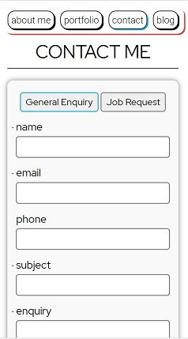

# My Portfolio Website

View the deployed site at [philcantrel.com](www.philcantrel.com)
This site is deployed with Netlify.

Visit the GitHub repo for the site [here](https://github.com/philthehuman/portfolio-website).

## Purpose

This portfolio site is built to be a virtual resume for prospective employers.
Not only does it contain detailed information about myself, my resume, contact details and social networks, it is also in and of itself a display of my web development abilities.
It is built from the ground up to work well on both mobile and desktop devices.

## Features

### About me
The home page contains information on my development skills and includes an elevator pitch of my abilities.
It also has a picture of myself to make the site feel more personal, and a call to action (hire me button).  

Listed at the bottom of the page is a brief overview of my resume including qualifications, work history, interests along with a link to download my full resume.
### Portfolio
The portfolio page is an aesthetically pleasing place for me to list any relevant project I've worked on. This helps display my best work to prospective employers.  

### Contact
The contact me page has a form that lets employers, clients or fellow programmers contact me directly. It has smart input fields (phone must be a number, email must be an email) and requires certain fields to be filled before it can be submitted. There is a visually modified radio button at the top of the form that allows clients to request a job, along with an option for general enquiries.  

  

There are social links to my LinkedIn, Twitter, GitHub and Facebook as well as my email and phone number listed at the bottom of the page.
### Blog
The blog page includes six blog posts with titles, images and links to read the entire article.  

## Sitemap

## Target Audience
The target audience for this project is prospective employers, clients and other developers and designers
## Tech stack
This website uses purely HTML and SCSS. There is no Javascript involved.
The website is deployed on Netlify and is connected to GitHub for instant deployment from bash.
